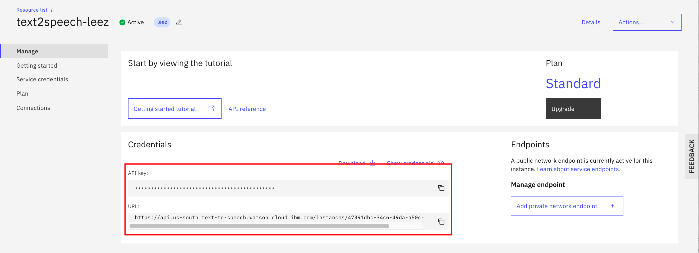

# Creating Custom Model of Watson Speech to Text Service

The `Watson Speech to Text` service offers a customization interface that you can use to augment its speech recognition capabilities. You can use customization to improve the accuracy of speech recognition requests by customizing a base model for your domain and audio. 

You can make three types of customization to the `Watson Speech to Text` service,

* Language Model Customization — with UTF-8 plain text files, you can enhance the existing base language model with domain-specific terminology, acronyms, jargon and expressions, which will improve speech recognition accuracy.
* Acoustic Model Customization — with audio files, you can improve accuracy when dealing with edge cases like heavy accents and background noise.
* Grammar Customization — this feature allows you to adapt the speech recognition based on specific rules limiting the choices of words returned. This is especially useful when dealing with alphanumeric IDs (eg. member ID, policy number, part number, etc).

Speech recognition works the same with or without a custom model. When you use a custom model for speech recognition, you can use all of the input and output parameters that are normally available with a recognition request.


## Language Model Customization

The `Watson Speech to Text` service was developed with a broad, general audience in mind. The service's base vocabulary contains many words that are used in everyday conversation. Its models provide sufficiently accurate recognition for many applications. But they can lack knowledge of specific terms that are associated with particular domains.

The language model customization interface can improve the accuracy of speech recognition for domains such as medicine, law, information technology, and others. By using language model customization, you can expand and tailor the vocabulary of a base model to include domain-specific terminology.

You create a custom language model and add corpora and words specific to your domain. Once you train the custom language model on your enhanced vocabulary, you can use it for customized speech recognition. The service can typically train any custom model in a matter of minutes. The level of effort that it takes to create a model depends on the data that you have available for the model.


## Acoustic Model Customization

Similarly, the `Watson Speech to Text` service was developed with base acoustic models that work well for various audio characteristics. But in cases like the following, adapting a base model to suit your audio can improve speech recognition:

* Your acoustic channel environment is unique. For example, the environment is noisy, microphone quality or positioning are suboptimal, or the audio suffers from far-field effects.
* Your speakers' speech patterns are atypical. For example, a speaker talks abnormally fast or the audio includes casual conversations.
* Your speakers' accents are pronounced. For example, the audio includes speakers who are talking in a non-native or second language.

The acoustic model customization interface can adapt a base model to your environment and speakers. You create a custom acoustic model and add audio data (audio resources) that closely match the acoustic signature of the audio that you want to transcribe. Once you train the custom acoustic model with your audio resources, you can use it for customized speech recognition.

The length of time that it takes the service to train the custom model depends on how much audio data the model contains. In general, training takes twice the length of the cumulative audio. The level of effort that it takes to create a model depends on the audio data that you have available for the model. It also depends on whether you use transcriptions of the audio.


## Grammars

Custom language models allow you to expand the service's base vocabulary. Grammars enable you to restrict the words that the service can recognize from that vocabulary. When you use a grammar with a custom language model for speech recognition, the service can recognize only words, phrases, and strings that are recognized by the grammar. Because the grammar defines a limited search space for valid matches, the service can deliver results faster and more accurately.

You add a grammar to a custom language model and train the model just as you do for a corpus. Unlike a corpus, however, you must explicitly specify that a grammar is to be used with a custom model during speech recognition.


## Exercise Flow

Out of the three types of `Watson Speech to Text` model customization, the `Language Model Customization` delivers the biggest bang for the buck. 

You are going to create a `Language Model Customization` for the remaining of the exercise. It can effectively improve the accuracy of speech recognition with minimal efforts. In order to have perfect result, you need to consider other model customizations.

Watson `Watson Speech to Text` is a probabilistic and contextual service, so training can include repetitive words and phrases to ‘weight’ the chance of the word being transcribed. The focus of training text data should be on ‘out-of-vocabulary’ words, and known words that the solution struggles with. Additional emphasis can also be put on high frequency in-vocabulary words.


### Step 1 - Clone the Repo

In a terminal, run:

```
$ git clone https://github.com/lee-zhg/watson-speech2text-custom-model.git

$ cd watson-speech2text-custom-model
```


### Step 2 - Create Watson Speech to Text Service

If you have an existing `Watson Speech to Text` service, you may retrieve its `API key` and `URL`, and skip the rest of the section.

To create an instance of `Watson Speech to Text` service,

1. Login to [IBM Cloud](https://cloud.ibm.com).

1. Navigate to `Watson Speech to text` catalog page (https://cloud.ibm.com/catalog/services/speech-to-text).

1. Select `Lite` or `Standard` plan.

1. Give a unique name.

1. Click `Create` button on the right.

1. Go to the `Manage` tab.

1. Record the service `API key` and `URL`.

    


### Step 3 - Setup Development Environment

For simplicity, you are going to use `Curl` API to customize your `Watson Speech to Text` service labuage model.

1. Open a terminal window or command window.

1. Execute command

    ```
    export apikey=<speech2text API key>
    
    export url=<speech2text URL>
    ```

    For example,

    ```
    export apikey=W0UsxM5-meL6Xm2Op9GPSjzLNLLDVUGrI-jyUSDdw
    
    export url=https://api.us-south.speech-to-text.watson.cloud.ibm.com/instances/ba85ae8-3bc9-4da4-9b3f-e9b8d0198de
    ```

> Note: if you did not record `<speech2text API key>` and/or `<speech2text URL>`, review the steps in the previous section.


### Step 4 - Create a Custom Language Model

You can create multiple custom models for the same or different domains. The process is the same for any model that you create. However, you can specify only a single custom model at a time with a recognition request.

#### Step 4.1 - Create a Custom Language Model

1. Execute the command below to create a custom language model.

    You use the POST /v1/customizations method to create a new custom language model. The method accepts a JSON object that defines the attributes of the new custom model as the body of the request. The new custom model is owned by the instance of the service whose credentials are used to create it.

    ```
    curl -X POST -u "apikey:$apikey" --header "Content-Type: application/json" --data "{\"name\": \"my_custom_model\",   \"base_model_name\": \"en-US_BroadbandModel\",   \"description\": \"My custom language model\"}" "$url/v1/customizations"
    ```

    The command creates a new custom language model named `my_custom_model`. The model is created for the base model `en-US-BroadbandModel` and has the description `My custom language model`. The Content-Type header specifies that JSON data is being passed to the method.

1. The command returns someething similar to

    ```
    Result

    {"customization_id": "ecdf5106-38c2-4103-afa6-c07f95a5f89a"}
    ```

    Each custom model is identified by a unique customization ID, which is a Globally Unique Identifier (GUID). 

1. Record the new customization_id.

    ```
    export customization_id=ecdf5106-38c2-4103-afa6-c07f95a5f89a
    ```

#### Step 4.2 - Add a Corpus to the Custom Language Model

Once you create your custom language model, the next step is to add data (domain-specific words) to the model. The recommended means of populating a custom model with new words is to add one or more corpora.

> Note: By providing sentences that include new words, corpora allow the service to learn the words in context. You can then augment or modify the model's words individually. Training a model only on individual words as opposed to words added from corpora is more time-consuming and can produce less effective results.

1. Review `my_training_corpus.txt` file. Sample corpus file `my_training_corpus.txt` is provided in the repo.

    A corpus is a plain text file that ideally contains sample sentences from your domain. The service parses a corpus file's contents and extracts any words that are not in its base vocabulary. Such words are referred to out-of-vocabulary (OOV) words.

    ```
    I like to order a Big Mac, please.
    I like to have a Big Mac, please.
    I like to order two Big Mac, please.
    I like to have three Big Mac, please.
    May I order a Big Mac, please?
    May I have ten Big Mac, please?
    One Big Mac to go.
    Have three Big Mac meals.

    I like to order a McDouble, please.
    I like to have a McDouble, please.
    I like to order two McDouble, please.
    I like to have three McDouble, please.
    May I order a McDouble, please?
    May I have ten McDouble, please?
    One McDoublec to go.
    Have three McDouble meals.

    I like to order a McFlurry with M&M'S Candies, please.
    I like to have a McFlurry with M&M'S Candies, please.
    I like to order two McFlurry with M&M'S Candies, please.
    I like to have three McFlurry with M&M'S Candies, please.
    May I order a McFlurry with M&M'S Candies, please?
    May I have ten McFlurry with M&M'S® Candies, please?
    One McFlurry with M&M'S Candies to go.
    Have three McFlurry with M&M'S Candies.

    I like to order a McFlurry with OREO Cookies, please.
    I like to have a McFlurry with OREO Cookies, please.
    I like to order two McFlurry with OREO Cookies, please.
    I like to have three McFlurry with OREO Cookies, please.
    May I order a McFlurry with OREO Cookies, please?
    May I have ten McFlurry with OREO Cookies, please?
    One McFlurry with OREO Cookies to go.
    Have three McFlurry with OREO Cookies.

    I like to order a McFlurry, please.
    I like to have a McFlurry, please.
    I like to order two McFlurry, please.
    I like to have three McFlurry, please.
    May I order a McFlurry, please?
    May I have ten McFlurry, please?
    One McFlurry to go.
    Have three McFlurry.
    ```    

    The sample corpus file `my_training_corpus.txt` focuses on improving accuracy of three specific terms that are most likely not in the base vocabulary. `McFlurry`, `McDouble` and `Big Mac`.

1. Execute the command below to add a corpus to the custom language model.

    ```
    curl -X POST -u "apikey:$apikey" --data-binary @my_training_corpus.txt "$url/v1/customizations/$customization_id/corpora/my_training_corpus"
    ```

1. To monitor the add corpus request

    ```
    curl -X GET -u "apikey:$apikey" "$url/v1/customizations/$customization_id/corpora/"
    ```

    or

    ```
    curl -X GET -u "apikey:$apikey" "$url/v1/customizations/$customization_id/corpora/my_training_corpus"
    ```

1. The command returns

    ```
    {
        "out_of_vocabulary_words": 3,
        "total_words": 293,
        "name": "my_training_corpus",
        "status": "analyzed"
    }
    ```


#### Step 4.3 - Add Words to the Custom Language Model

Although adding corpora is the recommended means of adding words to a custom language model, you can also add individual custom words to the model directly. The service adds the custom words to the custom model just as it does OOV words that it discovers from corpora.

If you have only one or a few words to add to a model, using corpora to add the words might not be practical or even viable. The simplest approach is to add a word with only its spelling. But you can also provide multiple pronunciations for the word and indicate how the word is to be displayed.


#### Step 4.4 - Train the Custom Language Model

Once you populate a custom language model with new words (by adding corpora, by adding grammars, or by adding the words directly), you must train the model on the new data. Training prepares the custom model to use the data in speech recognition. The model does not use words that you add via any means until you train it on the data.

1. You use the POST /v1/customizations/{customization_id}/train method to train a custom model. 

    ```
    curl -X POST -u "apikey:$apikey" "$url/v1/customizations/$customization_id/train?customization_weight=0.5"
    ```

1. The `customization_weight` parameter specifies the relative weight that is given to words from the custom model as opposed to words from the base vocabulary when the custom model is used for speech recognition. You can also specify a customization weight with any recognition request that uses the custom model. `0.5` is used in the above command.

1. To monitoring the train model request,

    ```
    curl -X GET -u "apikey:$apikey" "$url/v1/customizations/$customization_id"
    ```

1. While the model is being trained, it returns something similar to

    ```
    {
        "owner": "ba85aae8-3bc9-4da4-9b3f-e9b18d0198de",
        "base_model_name": "en-US_BroadbandModel",
        "customization_id": "ecdf5106-38c2-4103-afa6-c07f95a5f89a",
        "dialect": "en-US",
        "versions": ["en-US_BroadbandModel.v2020-01-16"],
        "created": "2020-08-14T21:03:04.923Z",
        "name": "my_custom_model",
        "description": "My custom language model",
        "progress": 0,
        "language": "en-US",
        "updated": "2020-08-14T22:13:04.974Z",
        "status": "training"
    }
    ```

1. After the model training is completed, it returns something similar to

    ```
    {
        "owner": "ba85aae8-3bc9-4da4-9b3f-e9b18d0198de",
        "base_model_name": "en-US_BroadbandModel",
        "customization_id": "ecdf5106-38c2-4103-afa6-c07f95a5f89a",
        "dialect": "en-US",
        "versions": ["en-US_BroadbandModel.v2020-01-16"],
        "created": "2020-08-14T21:03:04.923Z",
        "name": "my_custom_model",
        "description": "My custom language model",
        "progress": 100,
        "language": "en-US",
        "updated": "2020-08-14T22:06:41.713Z",
        "status": "available"
    }
    ```

#### Step 4.5 - Test the Custom Language Model

After the `Custom Language Model` is trained, you may check the accuracy improvement.

1. Execute the command below to transcribe the sample audio

    ```
    curl -X POST -u "apikey:$apikey" --header "Content-Type: audio/flac" --data-binary @audio-test.flac "$url/v1/recognize?language_customization_id=$customization_id"
    ```

1. It returns

    ```
    {
        "result_index": 0,
        "results": [
            {
                "final": true,
                "alternatives": [
                    {
                    "transcript": "I like to older of Big Mac please ",
                    "confidence": 0.74
                    }
                ]
            },
            {
                "final": true,
                "alternatives": [
                    {
                    "transcript": "May I have couple McFlurry ",
                    "confidence": 0.91
                    }
                ]
            }
        ]
    }
    ```

1. In contrast, you may transcribe the same audio file with the out-of-box model.

    ```
    curl -X POST -u "apikey:$apikey" --header "Content-Type: audio/flac" --data-binary @audio-test.flac "$url/v1/recognize?model=en-US_BroadbandModel"
    ```

1. The accuracy improvement is obvious with a minimal changes to the base model. And, you built the custom language model in less than 30 minutes.


### Step 5 - Helpful API of Watson Speech to Text Service

Below are a few API calls of `Watson Speech to Text` service that can be handy.

* List custom language models

    ```
    curl -X GET -u "apikey:$apikey" "$url/v1/customizations"
    ```

* Get information of a custom language model

    ```
    curl -X GET -u "apikey:$apikey" "$url/v1/customizations/$customization_id"
    ```

    It returns

    ```
    {
        "owner": "ba85aae8-3bc9-4da4-9b3f-e9b18d0198de",
        "base_model_name": "en-US_BroadbandModel",
        "customization_id": "85b71fc5-b762-416e-a83d-2d38b1974772",
        "dialect": "en-US",
        "versions": ["en-US_BroadbandModel.v2020-01-16"],
        "created": "2020-09-04T13:30:15.783Z",
        "name": "my_custom_model",
        "description": "My custom language model",
        "progress": 100,
        "language": "en-US",
        "updated": "2020-09-04T13:41:24.392Z",
        "status": "available"
    }
    ```

* List all models

    ```
    curl -X GET -u "apikey:$apikey" "$url/v1/models"
    ```

* Get information of a model

    ```
    curl -X GET -u "apikey:$apikey" "$url/v1/models/en-US_BroadbandModel"
    ```

    It returns

    ```
    {
        "name": "en-US_BroadbandModel",
        "rate": 16000,
        "language": "en-US",
        "description": "US English broadband model.",
        "supported_features": {
            "custom_language_model": true,
            "speaker_labels": true
        },
        "url": "https://api.us-south.speech-to-text.watson.cloud.ibm.com/instances/ba85aae8-3bc9-4da4-9b3f-e9b18d0198de/v1/models/en-US_BroadbandModel"
    }
    ```


## Links

* [Creating a custom language model](https://cloud.ibm.com/docs/speech-to-text?topic=speech-to-text-languageCreate)
* [Watson Speech-To-Text: How to Train Your Own Speech “Dragon” — Part 1: Data Collection and Preparation](https://medium.com/ibm-watson/watson-speech-to-text-how-to-train-your-own-speech-dragon-part-1-data-collection-and-fdd8cea4f4b8)
* [Watson Speech-To-Text: How to Train Your Own Speech “Dragon” — Part 2: Training with Data](https://medium.com/ibm-watson/watson-speech-to-text-how-to-train-your-own-speech-dragon-part-2-training-with-data-5116dac3f774)


## Learn more

* **Artificial Intelligence Code Patterns**: Enjoyed this Code Pattern? Check out our other [AI Code Patterns](https://developer.ibm.com/technologies/artificial-intelligence/).
* **AI and Data Code Pattern Playlist**: Bookmark our [playlist](https://www.youtube.com/playlist?list=PLzUbsvIyrNfknNewObx5N7uGZ5FKH0Fde) with all of our Code Pattern videos
* **With Watson**: Want to take your Watson app to the next level? Looking to utilize Watson Brand assets? [Join the With Watson program](https://www.ibm.com/watson/with-watson/) to leverage exclusive brand, marketing, and tech resources to amplify and accelerate your Watson embedded commercial solution.
* **Kubernetes on IBM Cloud**: Deliver your apps with the combined the power of [Kubernetes and Docker on IBM Cloud](https://www.ibm.com/cloud/container-service)


